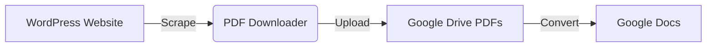

# Automated PDF Migration Pipeline

## Project Overview
This project automates the extraction, processing, and migration of PDF documents from WordPress-based websites to Google Drive, with conversion to editable Google Docs.

The pipeline consists of two main scripts:
1. **PDF Scraper**: Crawls a website's category pages, downloads PDF files, and uploads them to a specified Google Drive folder.
2. **PDF Converter**: Sorts PDFs by date (newest first), selects the latest 10, and converts them to Google Docs in another folder.

**Tech Stack:** Python, Google Colab, BeautifulSoup4, Requests, Google Drive API v3

**Note:** This code is designed for WordPress-based websites with standard category pagination and post structures. The selectors and patterns may need adjustment for other CMS platforms.

**Impact:** Automates migration of historical documents, ensuring chronological organization and reducing manual effort.

## Setup Instructions
1. **Open in Google Colab**: Upload `automated_pdf_pipeline.ipynb` to Google Colab.
2. **Enable Drive API**: 
   - Go to Google Cloud Console
   - Create a project or select existing
   - Enable Google Drive API
   - Create credentials (OAuth 2.0 Client ID)
3. **Authenticate**: Run the authentication cells in the notebook.
4. **Configure Folder IDs, URLs, and Selectors**:
   - Create two folders in Google Drive: one for PDFs, one for converted Docs
   - Get the folder IDs from the Drive URLs (the long string after `/folders/`)
   - Replace placeholders in the code:
     - `START_URL` (the website category page URL to scrape for PDFs)
     - `FOLDER_ID` (for PDF uploads)
     - `SOURCE_FOLDER_ID` (folder with PDFs to convert)
     - `DEST_FOLDER_ID` (folder for Google Docs output)
     - `ARTICLE_SELECTOR` (CSS selector for post links, default: WordPress standard)
     - `NEXT_PAGE_CLASS` (CSS class for pagination, default: WordPress standard)
     - `FALLBACK_URL_PATTERN` and `FALLBACK_TEXT_PATTERN` (patterns for finding posts if main selector fails)

## How to Run
1. **Run the Scraper**: Execute the first cell to scrape and upload PDFs from the target website.
2. **Run the Converter**: Execute the second cell to convert the latest 10 PDFs to Google Docs.
3. **Monitor Output**: Check the console for progress and any errors.

## Architecture

## Notes
- The scraper respects server load with delays between requests.
- PDFs are filtered by filename and deduplicated.
- Date parsing handles various formats in filenames.
- Ensure you have write access to the specified Drive folders.

## Ethical Considerations
This tool is intended for ethical public content scraping. Before using:

- **Check robots.txt**: Verify the target website's robots.txt file allows crawling
- **Review terms of service**: Ensure compliance with the website's terms
- **Rate limiting**: The tool includes delays, but monitor server load
- **Respect copyrights**: Only scrape content you have rights to use

Use responsibly and obtain permission when scraping non-public content.
